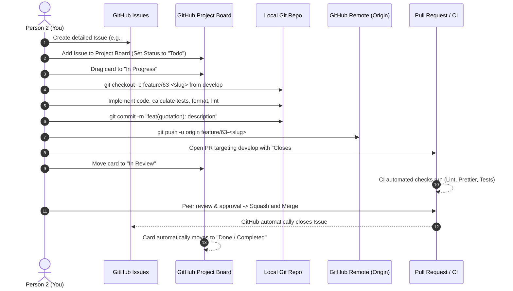
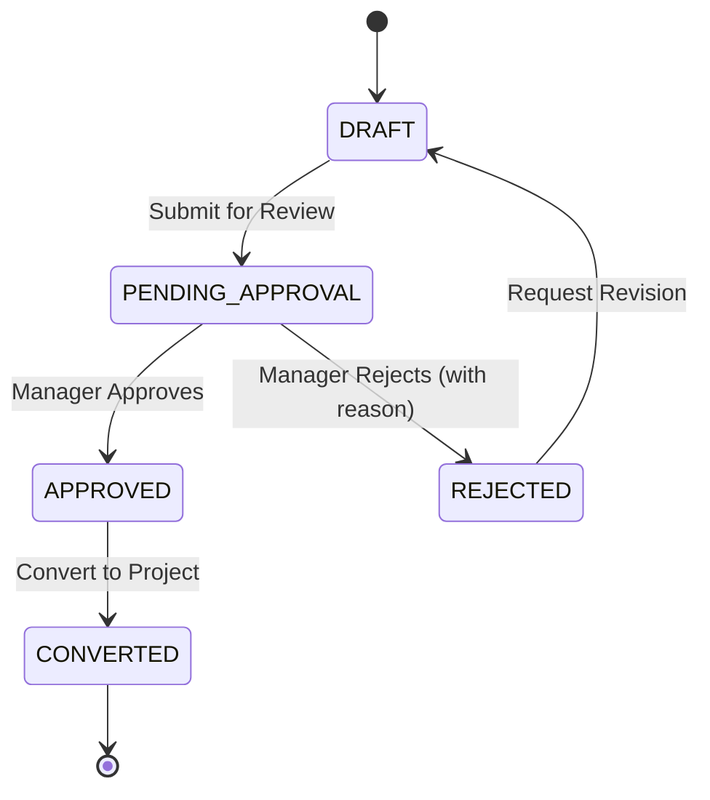

# Person 2: Quotations & Project Conversion Integration Roadmap
**Role & Main Responsibility:** Deliver the end-to-end Quotation-to-Project workflow from lead selection to approved project creation for ConstructPro-ERP (Sprint 7 Demo).

---

## 1. Architecture & Workflow Overview

```mermaid
flowchart TD
    A[Lead Selection in CRM] --> B[Create / Draft Quotation]
    B --> C[Item Calculation & Review]
    C --> D[Submit for Approval (PENDING_APPROVAL)]
    D --> E{Management Review}
    E -- Rejected --> F[REJECTED with Feedback]
    F --> G[Revise Quotation -> Resubmit]
    G --> D
    E -- Approved --> H[APPROVED Status]
    H --> I[Generate / Download PDF]
    H --> J[Convert to Project Action]
    J --> K{Already Converted?}
    K -- Yes (409 Conflict) --> L[Display Link to Existing Project]
    K -- No --> M[Call Project Service]
    M --> N[Create Project Record & Link ProjectId]
    N --> O[Quotation Status -> CONVERTED]
    O --> P[Trigger Project Notification]
```

### Core Services Involved

| Component | Repository Path | Responsibility |
| :--- | :--- | :--- |
| **Frontend Web App** | `../frontend/src/app/dashboard/quotations` | UI for Quotation list, create, edit, details, approval, PDF download, and project conversion. |
| **API Gateway** | `apps/api-gateway/src/controllers/quotations-gateway.controller.ts` | JWT Auth, RBAC guards (`SALES_MANAGER`, `ADMIN`), and HTTP proxying to quotation service. |
| **Quotation Service** | `apps/quotation-service/src` | Business logic, item calculations, status state machine, PDF trigger, and conversion orchestration. |
| **Project Service** | `apps/project-service/src` | Creates project instance from approved quotation via `/projects/from-quotation`. |
| **Document Service** | `apps/quotation-service/src/document.client.ts` | PDF document generation from quotation items and metadata. |
| **Prisma Database** | `prisma/schema.prisma` | PostgreSQL storage (`Quotation`, `QuotationItem`, `Lead`, `Project`). |

---

## 2. GitHub Agile Standard Operating Procedure (SOP)

This workflow outlines the exact sequence required for each major feature: **GitHub Issue &rarr; Project Board &rarr; Git Branch &rarr; Development &rarr; Pull Request &rarr; Merged & Completed**.



---

### Step-by-Step GitHub Execution Checklist

#### Phase A: Before Writing Any Code
1. **Navigate to GitHub Repository Issues**:
   - Go to `https://github.com/ConstructPro-ERP/backend` (or `frontend` depending on repository).
   - Click **New Issue**.
   - Use the template provided in the weekly sections below.
2. **Assign Issue to Yourself & Set Milestones**:
   - **Assignees:** Assign to your GitHub username.
   - **Labels:** e.g., `feature`, `quotations`, `sprint-7`.
   - **Projects:** Select the team's Sprint 7 Project Board.
   - **Milestone:** Sprint 7.
3. **Move Card on GitHub Project Board**:
   - Open the **Project Board**.
   - Your newly created issue will be in the **Backlog** or **Todo** column.
   - When you begin work, drag the card into **In Progress**.

#### Phase B: Branch Creation & Git Commands
Always branch off the latest updated `develop` branch:

```bash
# 1. Ensure working directory is clean
git status

# 2. Switch to develop and pull latest changes
git checkout develop
git pull origin develop

# 3. Create your feature branch using the repository convention:
# Convention: feature/<issue-number>-<short-description>
git checkout -b feature/63-quotation-pages-and-calc

# 4. Verify you are on the new branch
git branch
```

#### Phase C: Developing & Committing
Follow the repository's **Conventional Commits** standard:

- `feat(quotation): add GET /quotations list endpoint with pagination`
- `fix(quotation): resolve floating point item calculation mismatch`
- `test(quotation): add unit tests for quotation total calculations`
- `refactor(quotation): improve quotation status transition guards`

Before committing, run verification checks:
```bash
# In backend
npm run format:check
npm run lint
npm test

# In frontend
npm run lint
npm run build
```

Commit and push:
```bash
git add .
git commit -m "feat(quotation): connect quotation list and edit endpoints"
git push -u origin feature/63-quotation-pages-and-calc
```

#### Phase D: Creating the Pull Request (PR)
1. Go to the repository on GitHub. A banner will appear: `"Compare & pull request"`. Click it.
2. Ensure base branch is set to `develop` and compare branch is your feature branch.
3. **PR Title Format:**
   ```text
   feat(quotation): connect quotation list, create, edit and details pages (#63)
   ```
4. **PR Description Body:** (CRITICAL: include the magic closing keyword)
   ```markdown
   ## Description
   Implements quotation list, create, edit, and details endpoints and wires frontend forms with synchronized calculations.

   Closes #63

   ## Changes Made
   - Added GET /quotations and PUT /quotations/:id in quotation-service.
   - Forwarded routes in API Gateway with RBAC roles.
   - Replaced frontend preview state with live API query in QuotationsDashboardClient.
   - Fixed item calculation precision discrepancies.

   ## Verification Steps
   - [x] npm run lint passes.
   - [x] Unit tests pass: `npm test quotation`.
   - [x] Verified in browser with sample lead quotation.
   ```
5. Move the Project Board card from **In Progress** to **In Review**.

#### Phase E: Merging & Moving to "Completed"
1. Request review from team members or Tech Lead.
2. Ensure GitHub Actions / CI checks are all green.
3. Select **Squash and merge** (or **Merge pull request** according to team convention).
4. **Automatic Project Board Action:**
   - Because you included `Closes #63` in the PR description, GitHub will automatically close Issue `#63`.
   - If your Project Board has built-in workflow automation, closed issues automatically move to **Done / Completed**.
5. **Manual Fallback:**
   - If automation is not active, open the **Project Board**, locate your card, and drag it into the **Completed** (or **Done**) column.
6. Clean up branches:
   ```bash
   git checkout develop
   git pull origin develop
   git branch -d feature/63-quotation-pages-and-calc
   ```

---

## 3. Week-by-Week Technical Implementation Plan

---

### Week 9: Quotation List, Create, Edit & Details Pages + Item Calculations

#### Objectives
- Connect quotation list, create, edit, and details pages.
- Eliminate floating-point item calculation bugs between frontend and backend.
- Replace prototype/mock preview list with live API communication.

#### GitHub Issue Template (Week 9)
```markdown
Title: [Quotations] Connect quotation list, create, edit & details pages with calculation sync

Issue Description:
As a Sales Representative / Manager,
I want to view the list of quotations, create a quotation for a selected lead, edit draft quotations, and inspect itemized quotation details,
So that quotations accurately reflect line-item totals and match backend values without calculation discrepancies.

Acceptance Criteria:
- [ ] GET /quotations returns paginated quotations with lead details and line items.
- [ ] PUT /quotations/:id allows updating notes and items for quotations in DRAFT or PENDING_APPROVAL.
- [ ] API Gateway proxies GET /quotations, GET /quotations/:id, POST /quotations, and PUT /quotations/:id.
- [ ] Calculations: item amount = round2(quantity * unitPrice), totalAmount = round2(sum of item amounts).
- [ ] Frontend QuotationsDashboardClient loads live backend data on initial load.
- [ ] Quotation Details modal displays complete breakdown (items, unit prices, totals, customer name, date).

Technical Tasks:
1. Backend: Implement QuotationService.findAll(query) with pagination and filters.
2. Backend: Implement QuotationService.update(id, dto) for editable quotations.
3. Backend: Add gateway routes in QuotationsGatewayController.
4. Frontend: Add useEffect fetch in QuotationsDashboardClient.
5. Frontend: Unify round2 currency helper in quotationUtils.ts.
```

- **Branch Name:** `feature/<issue#>-quotation-crud-and-calculations`

#### Backend Implementation Details
1. **Extend `QuotationService` (`apps/quotation-service/src/quotation.service.ts`):**
   ```typescript
   async findAll(params: { leadId?: string; status?: QuotationStatus; page?: number; limit?: number }) {
     const page = Math.max(1, params.page ?? 1);
     const limit = Math.max(1, Math.min(100, params.limit ?? 20));
     const skip = (page - 1) * limit;

     const where: Prisma.QuotationWhereInput = {
       ...(params.leadId ? { leadId: params.leadId } : {}),
       ...(params.status ? { status: params.status } : {}),
     };

     const [total, items] = await Promise.all([
       this.prisma.quotation.count({ where }),
       this.prisma.quotation.findMany({
         where,
         skip,
         take: limit,
         orderBy: { createdAt: 'desc' },
         include: {
           items: true,
           lead: { select: { id: true, customerName: true, email: true, phone: true } },
         },
       }),
     ]);

     return { items, total, page, limit, totalPages: Math.ceil(total / limit) };
   }

   async update(id: string, dto: UpdateQuotationDto) {
     const quotation = await this.findOne(id);
     if (quotation.status === 'CONVERTED' || quotation.status === 'APPROVED') {
       throw new BadRequestException({
         code: 'QUOTATION_LOCKED',
         message: 'Approved or converted quotations cannot be edited.',
       });
     }

     const itemsWithAmounts = dto.items.map((item) => ({
       ...item,
       amount: round2(item.quantity * item.unitPrice),
     }));
     const totalAmount = round2(itemsWithAmounts.reduce((sum, i) => sum + i.amount, 0));

     return this.prisma.$transaction(async (tx) => {
       await tx.quotationItem.deleteMany({ where: { quotationId: id } });
       return tx.quotation.update({
         where: { id },
         data: {
           notes: dto.notes,
           totalAmount,
           items: {
             create: itemsWithAmounts.map((i) => ({
               itemName: i.itemName,
               quantity: i.quantity,
               unitPrice: i.unitPrice,
               amount: i.amount,
             })),
           },
         },
         include: { items: true, lead: true },
       });
     });
   }
   ```

2. **Calculation Precision Rules:**
   - Both frontend and backend must use a 2-decimal rounded float standard:
   ```typescript
   export function round2(value: number): number {
     return Math.round((value + Number.EPSILON) * 100) / 100;
   }
   ```
   - In PostgreSQL, ensure `Quotation.totalAmount`, `QuotationItem.unitPrice`, and `QuotationItem.amount` are defined as `Decimal(12, 2)`.

3. **Frontend Integration (`QuotationsDashboardClient.tsx`):**
   - Add a `useEffect` hook to fetch quotations on mount:
   ```typescript
   useEffect(() => {
     let isMounted = true;
     async function loadQuotations() {
       setQuotationsState({ kind: "loading" });
       try {
         const response = await apiClient.get<{ items: Quotation[] }>("/quotations");
         if (isMounted) {
           const list = normalizeQuotations(response.data.items ?? response.data);
           setQuotationsState(list.length > 0 ? { kind: "ready", quotations: list } : { kind: "empty" });
         }
       } catch (error) {
         if (isMounted) {
           setQuotationsState({ kind: "error", message: "Failed to load quotations." });
         }
       }
     }
     loadQuotations();
     return () => { isMounted = false; };
   }, []);
   ```

---

### Week 10: Approval, Rejection & Revision UI + Status Transitions & Validation Errors

#### Objectives
- Provide clear workflow actions for Managers: Approve, Reject, and Request Revision.
- Implement explicit backend validation error rendering on the frontend.
- Display visual quotation status transitions and rejection reasoning.

#### GitHub Issue Template (Week 10)
```markdown
Title: [Quotations] Complete approval, rejection, and revision UI with status lifecycle

Issue Description:
As a Sales Manager / Admin,
I want to review pending quotations, approve them, reject them with required comments, or send them back for revision,
So that quotations move through an auditable status pipeline and invalid operations display clear validation errors.

Acceptance Criteria:
- [ ] State Machine supported: DRAFT -> PENDING_APPROVAL -> APPROVED / REJECTED.
- [ ] PATCH /quotations/:id/reject endpoint implemented (requires non-empty rejectionReason).
- [ ] PATCH /quotations/:id/revise moves REJECTED back to DRAFT / PENDING_APPROVAL.
- [ ] Backend returns standardized error shape: { code, message, details }.
- [ ] Frontend displays modal confirmation for Approval and Rejection with reason textarea.
- [ ] Status transition badges render with appropriate colors and icons.
- [ ] Backend validation errors (400, 403, 404, 409) appear as descriptive alerts.

Technical Tasks:
1. Backend: Add QuotationService.reject(id, reason) and QuotationService.revise(id).
2. Backend: Add gateway routes with @Roles('ADMIN', 'SALES_MANAGER').
3. Frontend: Build RejectionReasonModal and StatusHistoryTimeline.
4. Frontend: Standardize ApiError toast and form banner messaging.
```

- **Branch Name:** `feature/<issue#>-quotation-approval-and-status-lifecycle`

#### Status Lifecycle State Machine



#### Backend Changes
1. **Rejection Endpoint in `quotation.service.ts`:**
   ```typescript
   async reject(id: string, reason: string) {
     const quotation = await this.findOne(id);
     if (quotation.status !== 'PENDING_APPROVAL') {
       throw new BadRequestException({
         code: 'INVALID_STATUS_TRANSITION',
         message: `Cannot reject a quotation with status ${quotation.status}. Only PENDING_APPROVAL quotations can be rejected.`,
       });
     }
     if (!reason || reason.trim().length < 5) {
       throw new BadRequestException({
         code: 'REJECTION_REASON_REQUIRED',
         message: 'A rejection reason of at least 5 characters is required.',
       });
     }

     return this.prisma.quotation.update({
       where: { id },
       data: {
         status: 'REJECTED',
         notes: quotation.notes ? `${quotation.notes}\n[Rejection Reason]: ${reason}` : `[Rejection Reason]: ${reason}`,
       },
       include: { items: true },
     });
   }
   ```

2. **Standardized Error Response Formatter (`apps/api-gateway/src/filters/http-exception.filter.ts`):**
   ```json
   {
     "statusCode": 400,
     "code": "VALIDATION_ERROR",
     "message": "Validation failed on submitted quotation items.",
     "details": [
       { "field": "items.0.quantity", "error": "quantity must be greater than zero" },
       { "field": "items.0.unitPrice", "error": "unitPrice must be a positive number" }
     ]
   }
   ```

3. **Frontend Status Badges & Rejection Modal:**
   - Render contextual action buttons on each card/detail view:
     - If `PENDING_APPROVAL`: Display green **Approve** button and red **Reject** button.
     - If `REJECTED`: Display amber **Revise / Edit** button and show previous rejection reason.
     - If `APPROVED`: Display purple **Convert to Project** and **Download PDF** button.
     - If `CONVERTED`: Display green badge with direct link: `[View Project #ID]`.

---

### Week 11: PDF Generation/Download & Quotation-to-Project Conversion

#### Objectives
- Connect PDF generation and binary/signed download.
- Integrate Quotation-to-Project conversion with project service.
- Handle duplicate conversion conflicts (HTTP 409 Conflict) idempotently.

#### GitHub Issue Template (Week 11)
```markdown
Title: [Quotations] Quotation PDF generation/download & project conversion integration

Issue Description:
As an Estimator or Project Manager,
I want to generate/download a PDF copy of an approved quotation and convert the quotation into an active Project,
So that project planning starts automatically without double-converting existing quotations.

Acceptance Criteria:
- [ ] GET /quotations/:id/pdf generates or returns direct URL/stream to download quotation PDF.
- [ ] "Download PDF" button in UI triggers download with filename Quotation-<ID>.pdf.
- [ ] PATCH /quotations/:id/approve (or convert) verifies quotation is APPROVED and not already CONVERTED.
- [ ] If already converted, returns 409 Conflict: { code: 'ALREADY_CONVERTED', projectId: '...' }.
- [ ] Frontend displays modal to review project creation parameters (Project Name, Start Date, PM).
- [ ] Upon 409 Conflict, UI smoothly shows "Already converted to Project" with clickable link.

Technical Tasks:
1. Backend: Implement PDF download proxy in QuotationsGatewayController and DocumentClient.
2. Backend: Validate QuotationService.approveAndConvert idempotency and projectClient communication.
3. Frontend: Add Download PDF action and ConvertProjectModal.
4. Frontend: Handle 409 Conflict gracefully in QuotationsDashboardClient.
```

- **Branch Name:** `feature/<issue#>-quotation-pdf-and-project-conversion`

#### Backend Project Conversion Flow
Verify the conversion logic in `apps/quotation-service/src/quotation.service.ts`:

```typescript
async approveAndConvert(id: string, dto?: ApproveQuotationDto) {
  const quotation = await this.prisma.quotation.findUnique({
    where: { id },
    include: { items: true, lead: true },
  });

  if (!quotation) {
    throw new NotFoundException({ code: 'QUOTATION_NOT_FOUND', message: 'Quotation not found.' });
  }

  // Idempotency check: BR 10.2 Duplicate conversion prevention
  if (quotation.status === 'CONVERTED' || quotation.projectId !== null) {
    throw new ConflictException({
      code: 'ALREADY_CONVERTED',
      message: 'Quotation has already been converted to a project.',
      details: { projectId: quotation.projectId },
    });
  }

  if (quotation.status === 'REJECTED') {
    throw new BadRequestException({
      code: 'QUOTATION_REJECTED',
      message: 'A rejected quotation cannot be converted.',
    });
  }

  // Step 1: Create Project through ProjectClient
  const { projectId } = await this.projectClient.createFromQuotation({
    quotationId: id,
    leadId: quotation.leadId,
    projectName: dto?.projectName ?? `Project for ${quotation.lead.customerName}`,
    targetProjectId: dto?.targetProjectId,
    startDate: dto?.startDate ?? new Date().toISOString(),
    budget: dto?.budget ?? Number(quotation.totalAmount),
    projectManagerId: dto?.projectManagerId,
  });

  // Step 2: Atomic update to CONVERTED
  const updatedQuotation = await this.prisma.quotation.update({
    where: { id },
    data: {
      status: 'CONVERTED',
      projectId,
    },
    include: { items: true },
  });

  // Step 3: Best-effort notification
  try {
    await this.notificationClient.notifyProjectCreated(id, projectId);
  } catch (err) {
    this.logger.warn(`Failed to dispatch project creation notification for ${id}: ${err}`);
  }

  return { quotation: updatedQuotation, projectId, projectStatus: 'ACTIVE' };
}
```

#### Frontend Duplicate Conversion Handling (`QuotationsDashboardClient.tsx`)
```typescript
const handleConvertQuotation = async (quotation: Quotation) => {
  setIsSubmitting(true);
  try {
    const res = await apiClient.patch<{ quotation: Quotation; projectId: string }>(
      `/quotations/${quotation.id}/approve`,
    );
    replaceQuotationInState(res.data.quotation);
    setFeedback({
      tone: "success",
      message: `Quotation converted successfully! Project ID: ${res.data.projectId}`,
    });
  } catch (error) {
    if (isAlreadyConvertedError(error)) {
      setFeedback({
        tone: "info",
        message: "Notice: This quotation has already been converted into an active project.",
      });
      // Refresh local state to update the card status to CONVERTED
      const refreshed = await apiClient.get<Quotation>(`/quotations/${quotation.id}`);
      replaceQuotationInState(refreshed.data);
    } else {
      setFeedback({
        tone: "error",
        message: error instanceof Error ? error.message : "Failed to convert quotation.",
      });
    }
  } finally {
    setIsSubmitting(false);
  }
};
```

---

### Week 12: Full Workflow Testing, Bug Fixing & Sprint 7 Demo Preparation

#### Objectives
- Perform comprehensive end-to-end testing across backend and frontend.
- Eliminate edge-case bugs (e.g., negative quantities, zero amounts, concurrent conversions).
- Prepare seed scripts and sample data for the Sprint 7 live demonstration.

#### GitHub Issue Template (Week 12)
```markdown
Title: [Quotations] E2E integration testing, bug fixes & Sprint 7 demo data preparation

Issue Description:
As the Engineering Team and Stakeholders,
We need a verified, bug-free quotation-to-project workflow backed by realistic sample data,
So that the Sprint 7 demo executes flawlessly without errors or broken mock references.

Acceptance Criteria:
- [ ] All E2E supertest suites in test/quotation-service/quotation.e2e-spec.ts pass.
- [ ] Unit tests cover quotation item calculations, rounding, and status transitions.
- [ ] Sample quotation demo dataset seeded in PostgreSQL database.
- [ ] Demo script document prepared covering step-by-step walkthrough.
- [ ] Zero unhandled frontend runtime crashes when network or API throws errors.

Technical Tasks:
1. Run and verify test/quotation-service/quotation.e2e-spec.ts.
2. Create prisma/seeds/quotations-demo-seed.ts.
3. Conduct end-to-end role walkthrough (Sales Rep -> Manager -> Project Manager).
```

- **Branch Name:** `feature/<issue#>-quotation-tests-and-demo-data`

#### Demo Data Seeding Script (`prisma/seeds/quotation-demo.seed.ts`)
Run this script to set up clean, realistic demo records:

```typescript
import { PrismaClient, QuotationStatus } from '@prisma/client';

const prisma = new PrismaClient();

async function seedQuotationDemo() {
  console.log('Seeding Sprint 7 Quotation Demo Data...');

  // 1. Ensure Manager User & Role exist
  const managerRole = await prisma.role.upsert({
    where: { roleName: 'MANAGER' },
    update: {},
    create: { roleName: 'MANAGER', description: 'General & Sales Manager' },
  });

  const managerUser = await prisma.user.upsert({
    where: { email: 'manager.demo@constructpro.com' },
    update: {},
    create: {
      fullName: 'Alex Vance (Sales Manager)',
      email: 'manager.demo@constructpro.com',
      roleId: managerRole.id,
      status: 'ACTIVE',
    },
  });

  // 2. Demo Leads
  const lead1 = await prisma.lead.create({
    data: {
      customerName: 'Skyline Heights Commercial Complex',
      email: 'contact@skylineheights.com',
      phone: '+94 11 234 5678',
      status: 'QUALIFIED',
    },
  });

  const lead2 = await prisma.lead.create({
    data: {
      customerName: 'Lotus Villa Residential Project',
      email: 'info@lotusvilla.lk',
      phone: '+94 77 123 4567',
      status: 'CONTACTED',
    },
  });

  // 3. Pending Quotation (for live Approval demo)
  await prisma.quotation.create({
    data: {
      leadId: lead1.id,
      status: 'PENDING_APPROVAL',
      notes: 'Initial quotation submitted for client site preparation and structural steel.',
      totalAmount: 4850000.00,
      items: {
        create: [
          { itemName: 'Site Survey & Soil Investigation', quantity: 1, unitPrice: 350000.00, amount: 350000.00 },
          { itemName: 'Reinforced Concrete Foundation (Grade 30)', quantity: 300, unitPrice: 10000.00, amount: 3000000.00 },
          { itemName: 'Structural Steel Framing (tons)', quantity: 10, unitPrice: 150000.00, amount: 1500000.00 },
        ],
      },
    },
  });

  // 4. Approved Quotation (ready for live Project Conversion demo)
  await prisma.quotation.create({
    data: {
      leadId: lead2.id,
      status: 'APPROVED',
      notes: 'Approved by management. Ready for conversion into active construction project.',
      totalAmount: 2200000.00,
      items: {
        create: [
          { itemName: 'Architectural Design & Blueprint Finalization', quantity: 1, unitPrice: 700000.00, amount: 700000.00 },
          { itemName: 'Masonry & Plastering Works', quantity: 150, unitPrice: 10000.00, amount: 1500000.00 },
        ],
      },
    },
  });

  console.log('Sprint 7 Quotation Demo Data seeded successfully.');
}

seedQuotationDemo().catch(console.error).finally(() => prisma.$disconnect());
```

---

## 4. Live Sprint 7 Demo Walkthrough Script

During the sprint demo, follow this narrative order to showcase full completion of Person 2's responsibilities:

| Step | Action | Screen / UI Element | Expected Behavior |
| :--- | :--- | :--- | :--- |
| **1. Lead Selection** | Select Lead "Skyline Heights" | Quotations &rarr; "Create Quotation" form | Lead details auto-populate. |
| **2. Dynamic Calculation** | Enter 3 items with quantities and unit prices | Item rows in form | Total Amount automatically sums correctly to 2 decimal places with no float drift. |
| **3. Submission** | Click "Submit Quotation" | Form Submit Button | Quotation is created with badge `PENDING_APPROVAL`. Appears at the top of the list. |
| **4. Manager Rejection** | Log in as Manager, select test quotation, click "Reject" | Quotation Card &rarr; Rejection Modal | Manager inputs comment; badge transitions to `REJECTED` with reason banner displayed. |
| **5. Revision Flow** | Edit rejected quotation, modify quantity, re-submit | Quotation Edit Modal | Status changes to `PENDING_APPROVAL` with updated grand total. |
| **6. Manager Approval** | Click "Approve" button | Quotation Card Action | Status transitions smoothly to `APPROVED`. |
| **7. PDF Download** | Click "Download Quotation PDF" | PDF Button | PDF file downloads with quotation reference number, items, and company branding. |
| **8. Project Conversion** | Click "Convert to Project" button | Project Conversion Dialog | Quotation status turns to `CONVERTED`. Clickable banner `[View Project #ID]` appears. |
| **9. Idempotency Check** | Attempt to re-trigger conversion or double-click | Project Conversion Button | UI gracefully informs: "Quotation already converted to Project", preventing duplicate creation. |

---

## 5. Quick Git & Development Command Reference

### Daily Development Flow
```bash
# Start your day: update develop
git checkout develop
git pull origin develop

# Start a feature branch
git checkout -b feature/<issue-number>-<feature-name>

# Check status and files
git status

# Format & Lint
npm run lint
npm run format

# Run tests
npm test

# Commit using conventional commits
git add -A
git commit -m "feat(quotation): implement <feature>"

# Push to origin
git push -u origin feature/<issue-number>-<feature-name>
```

### Resetting or Syncing with Upstream
```bash
# If your local branch is behind origin
git pull --rebase origin develop

# Stash uncommitted changes temporarily
git stash
git pull origin develop
git stash pop
```
